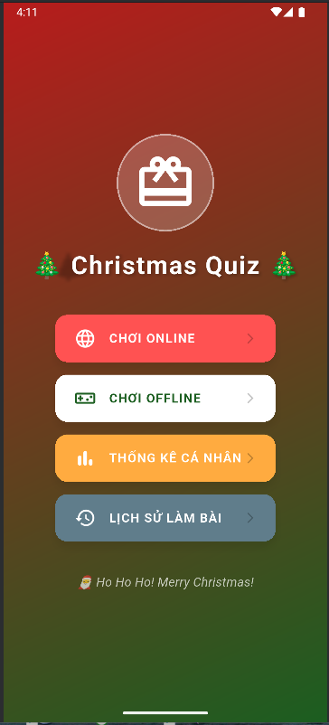
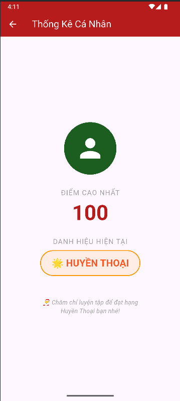
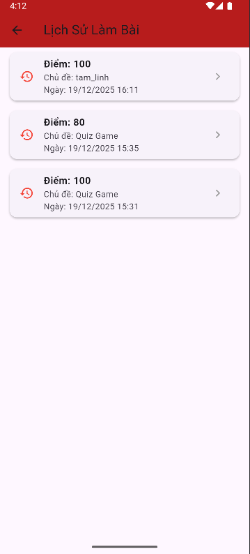
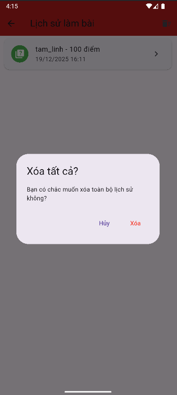

# quiz_app

A new Flutter project.

## Getting Started

## 📸 Ảnh Chụp Màn Hình (Screenshots)

Đây là các ảnh chụp mô tả quá trình tương tác và các chức năng chính của ứng dụng:

### 1. Màn Hình Chính và Danh Sách Ghi Chú

### 2. Giao Diện Tạo Mới (Trước khi nhập)

### 3. Giao Diện Tạo Mới (Đã nhập dữ liệu)

### 4. Kết Quả Sau Khi Thêm Ghi Chú

This project is a starting point for a Flutter application.

A few resources to get you started if this is your first Flutter project:

- [Lab: Write your first Flutter app](https://docs.flutter.dev/get-started/codelab)
- [Cookbook: Useful Flutter samples](https://docs.flutter.dev/cookbook)

For help getting started with Flutter development, view the
[online documentation](https://docs.flutter.dev/), which offers tutorials,
samples, guidance on mobile development, and a full API reference.
